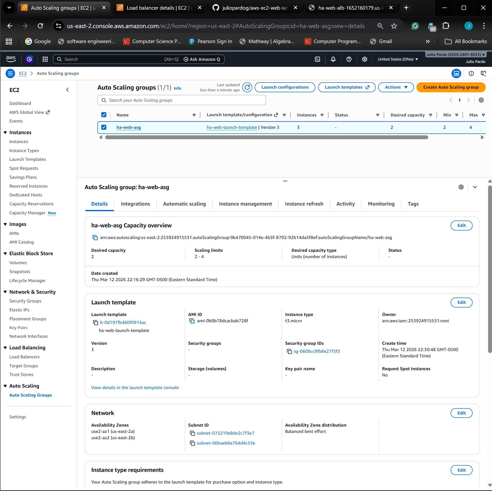

# AWS Highly Available Web Server

This project demonstrates how to build a **highly available web server architecture on AWS** using EC2, an Application Load Balancer (ALB), and an Auto Scaling Group deployed across multiple Availability Zones.

The goal of this project is to simulate a real-world production architecture where traffic is distributed across multiple servers and infrastructure automatically recovers from instance failures.

---

# Architecture Overview

The system uses the following AWS services:

- Amazon EC2
- Application Load Balancer (ALB)
- Target Groups
- Auto Scaling Group
- Launch Templates
- User Data Script
- Multi–Availability Zone Deployment

Traffic flow:
User → Application Load Balancer → Target Group → EC2 Instances (Auto Scaling Group)


The Application Load Balancer distributes incoming traffic across multiple EC2 instances to improve availability and fault tolerance.

---

# Load Balancer Configuration

The Application Load Balancer is configured as **internet-facing** and routes HTTP traffic to a target group containing the EC2 instances.


---

# Auto Scaling Group

The Auto Scaling Group maintains a minimum number of running instances and automatically replaces failed instances.

Configuration used in this project:

Minimum instances: 2  
Desired instances: 2  
Maximum instances: 4  



---

# Load Balancing Verification

To verify that the load balancer distributes traffic correctly, the web page displays the **instance ID of the EC2 instance serving the request**.

Refreshing the page returns different instance IDs, proving that the load balancer is distributing requests across multiple instances.


---

# User Data Script

Each EC2 instance is configured automatically using a **User Data script** that installs Apache and displays the instance ID.

File location:
scripts/user-data.sh


Script used:

```bash
#!/bin/bash

yum update -y
yum install -y httpd

INSTANCE_ID=$(curl http://169.254.169.254/latest/meta-data/instance-id)

echo "<h1>Highly Available AWS Web Server</h1>" > /var/www/html/index.html
echo "<p>Instance ID: $INSTANCE_ID</p>" >> /var/www/html/index.html

systemctl start httpd
systemctl enable httpd

