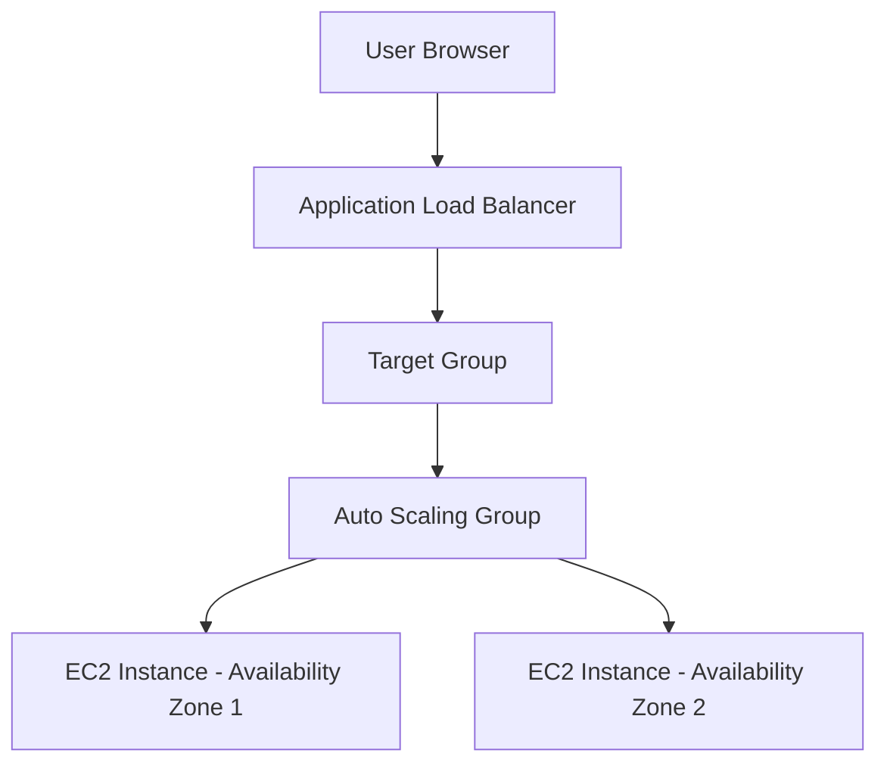

# AWS High Availability Architecture

This diagram illustrates the architecture used in this project.  
The system distributes incoming traffic across multiple EC2 instances deployed in different Availability Zones to ensure high availability and fault tolerance.

